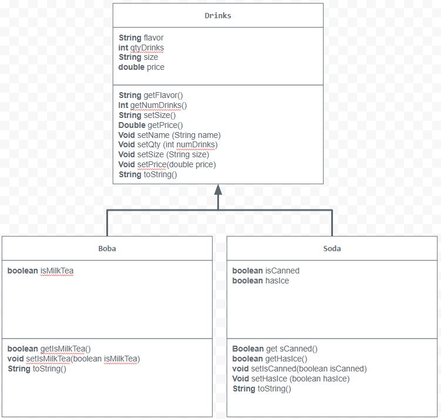

# Store-Management-Project
This is my Unit 2 project for Computer Science A. 
# Unit 2 - Store Management Project

## Introduction

You are opening a new business in your community! Businesses often need programs to manage the products and services they offer and track orders and requests from customers. Your goal is to create a store management system for your business.

## Requirements

Use your knowledge of object-oriented programming and class structure and design to create your store management system:
- **Create a class hierarchy** – Develop a superclass that represents a product or service your business offers and one or more subclasses that extend the superclass to represent more specific types of products or services.
- **Declare instance variables** – Declare instance variables in the superclass that are shared with the subclasses and instance variables in the subclasses that are not shared with the superclass.
- **Write constructors** – Write no-argument and parameterized constructors in the superclass and subclasses. Subclass constructors use the super keyword to call the superclass constructor.
- **Implement accessor and mutator methods** – Write accessor and mutator methods for instance variables that should be accessible and/or modifiable from outside of the class.
- **Implement a toString() method** – Write toString() methods in the superclass and subclasses that return information about the state of an object.

## UML Diagram

## Description

how that is used to output information for your store in the console.

My project is about a store that sells drinks. I chose to create this store because I wanted to create something like a boba tea store. For the superclass of my code, it was a drink. When ordering a drink from my store, the customer would have to choose which drink they wanted, the size, and how many drinks. Then the price for the drink would also be inputted. In the program, these components were turned to instance variables in the superclass.

Then I created two subclasses, boba and soda. This was to represent the types of drinks. In the boba subclass, it would ask if the boba is a milk tea. Then for the soda class, it would see if the soda is in a can and if the customer wanted ice.

The response that I expect from my program is to tell me information about the order. What happens when the values are inputted in (using the parameterized constructor), then when a value is changed (using the mutator method), and then when the order is inputted, inputted then outputted (overriding the toString). With this expectation, I would have the values

*ask aiello about if I should just multiply everything together and then output the total price
